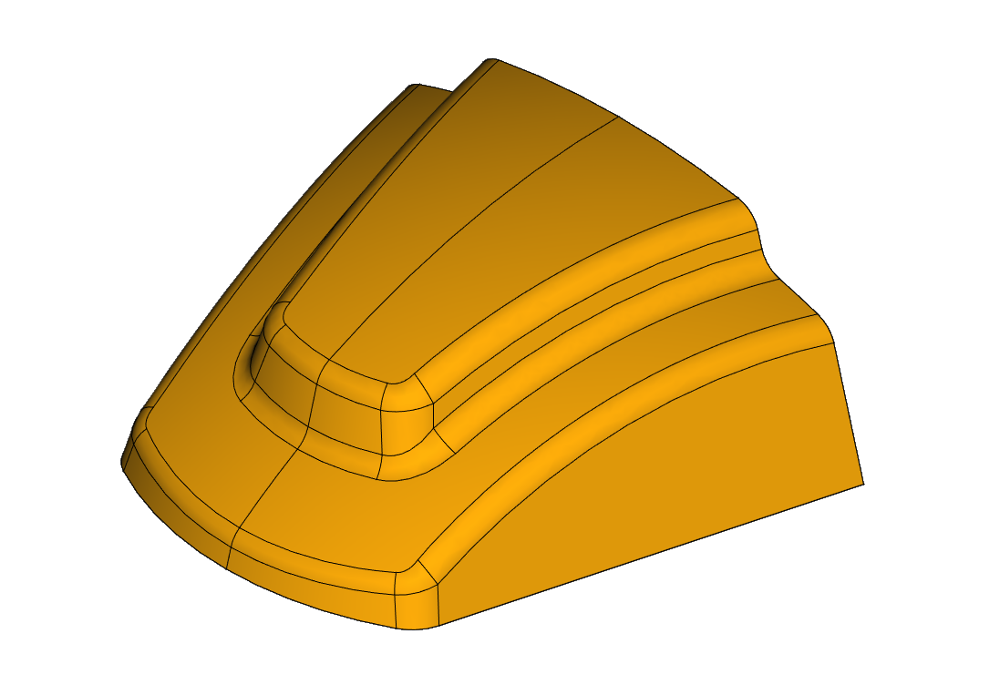
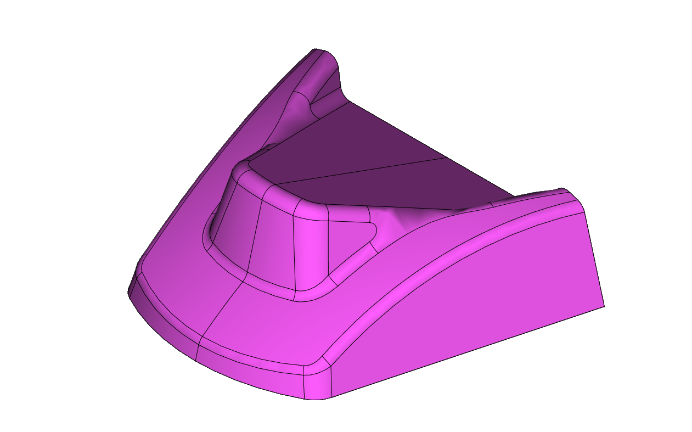

## Images

## Notes

Phase 2 of this challenge was one of the most involved. I did some 
manual surface work to get the fillets right. The last boolean 
operation on the model tree took over 2 hours to calculate.
