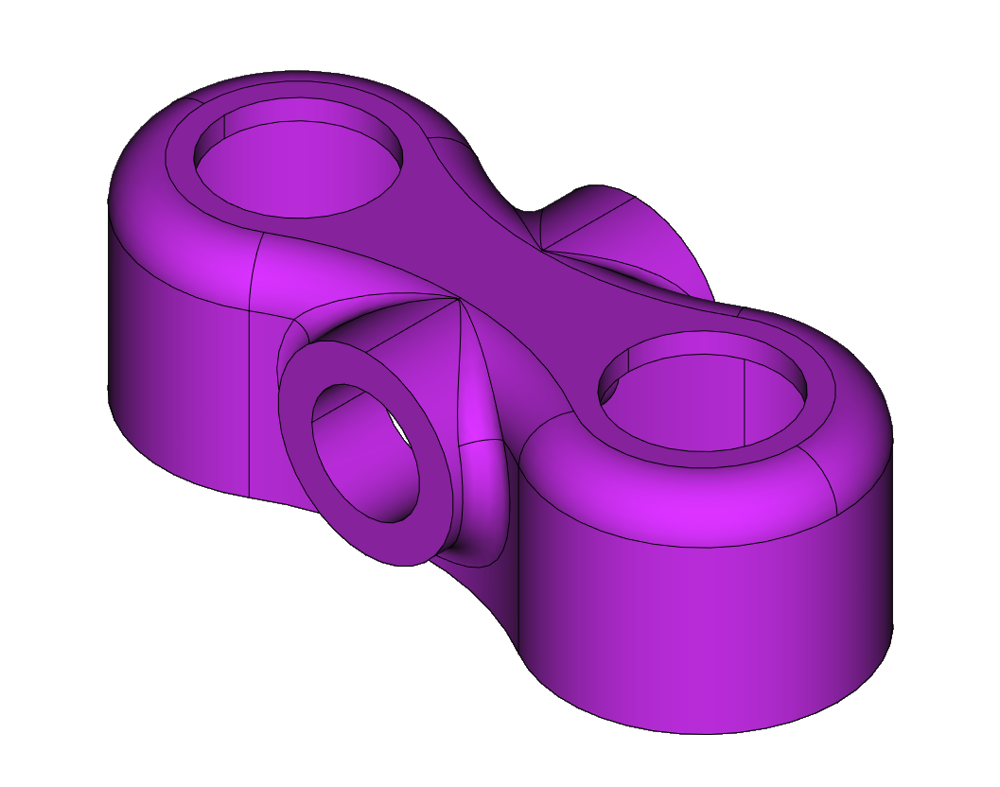
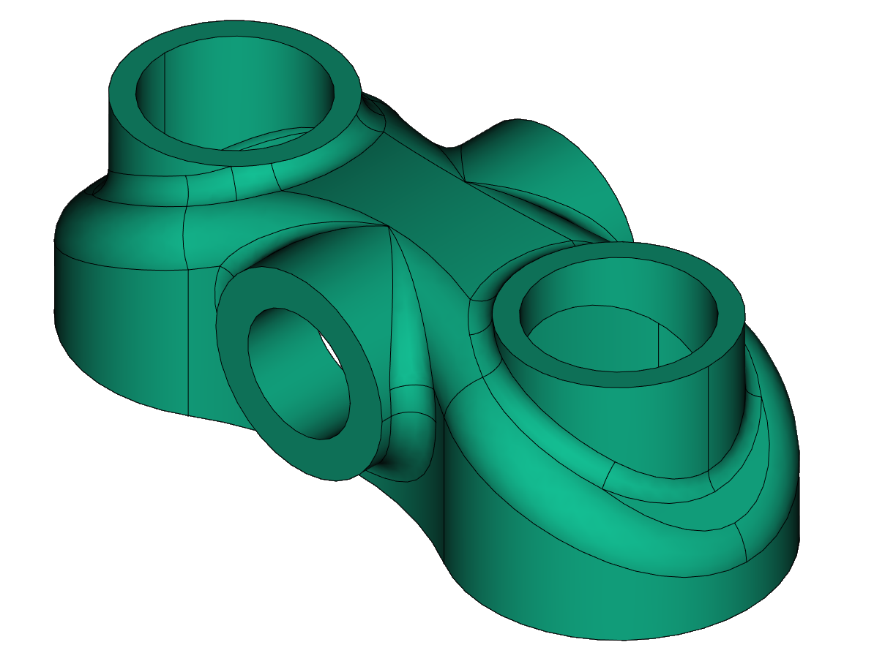
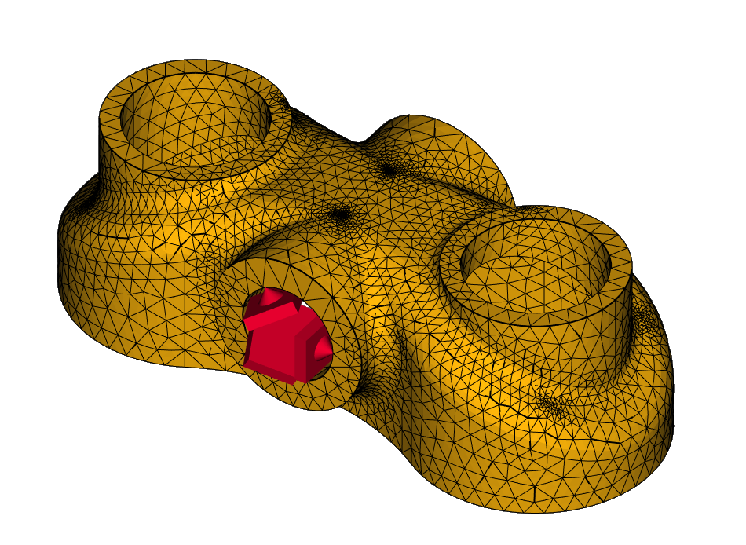
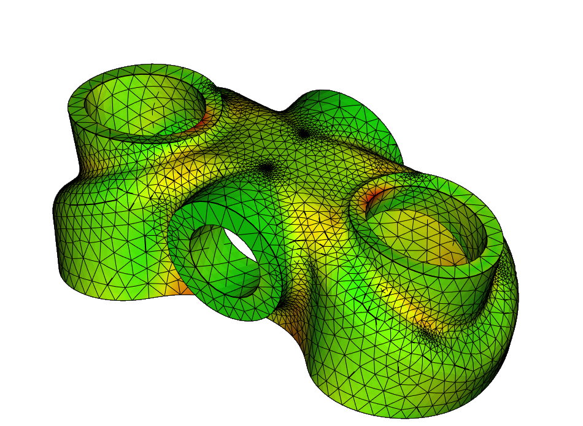

## Images

## Notes

These are some of the coolest ones IMO. The workflow for them was:
- model as little of the part as possible,
  taking advantage of symmetry.
- Put the fillets into the 'sliver' of the part.
  OCC handles fillets much better when it doesn't have to wrap them
  around an entire object.
- Use multitransform to make the entire part. Remember to refine
  the final object for visual niceness.

This approach has become my go-to for most parts. Work very well.
